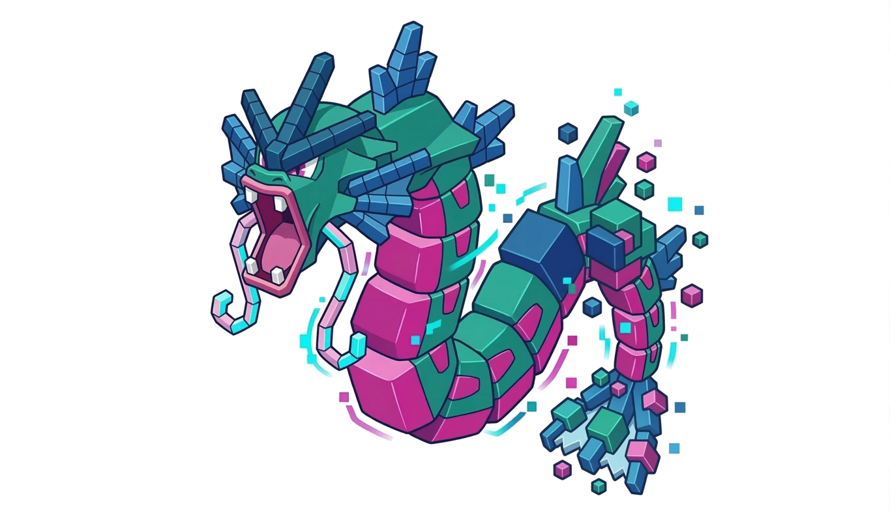

# `gyaradax`: Gyrokinetics in JAX

<p align="center">
  
</p>

`gyaradax` is a high-performance JAX code for local flux-tube gyrokinetic simulations. It is based on the [GKW code](https://bitbucket.org/gkw/gkw). It provides a differentiable simulation core for the electrostatic, adiabatic-electron Vlasov-Poisson system.

This was made possible with significant usage of agentic workflows (codex, claude code, gemini-cli).

## Installation

```bash
uv venv --python 3.12
source .venv/bin/activate
uv pip install -e ".[dev]"
```

This installs `gyaradax` in editable mode with JAX (CUDA 12), numpy, and dev tools (pytest, ruff, black).

## Structure

- **`solver.py`**: Linear and nonlinear Terms (I-VIII), RK4 integrator.
- **`gksimulate.py`**: Interface for trajectory generation.
- **`integrals.py`**: Field solvers and flux integrals.
- **`geometry.py`**: Parsers for GKW geometry files and metric tensor coefficients.
- **`params.py`**: Configuration pytrees.
- **`stencils.py`**: Finite difference stencil definitions.
- **`diag.py`**: Diagnostics (growth rate, frequency, spectral).
- **`plot_utils.py`**: Visualization.

## Workflows
### Configuration from GKW
If you have an existing GKW run, you can extract its parameters and geometry into yaml:
```bash
PYTHONPATH=. python scripts/gkw_to_yaml.py /path/to/gkw_run configs/my_sim.yaml
```

### Run a Simulation
```python
from gyaradax.simulate import gk_from_config, gksimulate, gk_init, gk_run, default_log

# Load config and run with IO/checkpointing
df, geometry, params, state, pre = gk_from_config("configs/my_sim.yaml")
df, phi, fluxes, state = gksimulate(
  df, geometry, params, state, 400, pre=pre,
  output_dir="outputs", checkpoint_interval=40
)
```

### Pure Computation (no IO, notebook-friendly)
```python
from gyaradax.simulate import gk_init, gk_run

df, state = gk_init(geometry, params)
df, phi, fluxes, state = gk_run(df, geometry, params, state, n_steps=1000, pre=pre)
```

### Resume from Checkpoints
`gyaradax` supports resuming from internal `.npz` snapshots or GKW binary `K` files:
```python
from gyaradax.utils import load_checkpoint, load_gkw_k_dump
from gyaradax.solver import GKState

# resume from internal checkpoint
ckpt = load_checkpoint("outputs/step_000040.npz")
state_ckpt = GKState(
  time=ckpt["time"],
  step=ckpt["step"],
  accumulated_norm_factor=ckpt["accumulated_norm_factor"],
  window_start_amp=ckpt["window_start_amp"],
  last_growth_rate=ckpt["last_growth_rate"]
)
df, phi, fluxes, state = gksimulate(ckpt["df"], geometry, params, state_ckpt, 400, pre=pre)

# resume from GKW dump K01
df_k = load_gkw_k_dump("/path/to/gkw/run/K01", resolution, n_species=1)
df, phi, fluxes, state = gksimulate(df_k, geometry, params, state_k, 400, pre=pre)
```

## Testing & Validation
Run the unit and integration test suite:
```bash
PYTHONPATH=. pytest tests/
```

`gyaradax` maintains strict numerical parity with GKW (relative error $< 10^{-5}$). You can run the physics validation script to verify this on your local machine:
```bash
PYTHONPATH=. python scripts/validate_physics.py --config configs/iteration_13.yaml --ref_dir gkw_ref/data/iteration_13
```

## TODO
- [ ] empirical validation against gkw dumps
- [ ] proper validation on [the gkw paper](docs/gkw.pdf)
- [ ] vmappable simulation loop (blocked because of IO)
- [ ] fix growth rate computation
- [ ] identify bottlenecks and cheap speedups