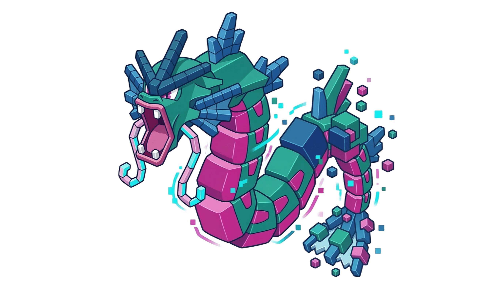

# `gyaradax`: Gyrokinetics in JAX

<p align="center">
  
</p>

`gyaradax` is a high-performance JAX code for local flux-tube gyrokinetic simulations. It is based on the [GKW code](https://bitbucket.org/gkw/gkw). It provides a differentiable simulation core for the electrostatic, adiabatic-electron Vlasov-Poisson system.

This was made possible with significant usage of agentic workflows (gemini, codex).

## Structure

- **`solver.py`**: Linear and nonlinear Terms (I-VIII), RK4 integrator.
- **`simulate.py`**: Interface for trajectory generation.
- **`integrals.py`**: Field solvers and flux integrals.
- **`geometry.py`**: Parsers for GKW geometry files and metric tensor coefficients.
- **`params.py`**: Configuration pytrees.
- **`stencils.py`**: Finite difference stencil definitions.
- **`diag.py`**: Diagnostics (growth rate, frequency, spectral).
- **`plot_utils.py`**: Visualization.

## Workflows
### Configuration from GKW
If you have an existing GKW run, you can extract its parameters and geometry into yaml:
```bash
PYTHONPATH=. python scripts/gkw_to_yaml.py /path/to/gkw_run configs/my_sim.yaml
```

### Run a Simulation
```python
from gyaradax import simulate

df, final_state, perf = simulate(
    "configs/my_sim.yaml",
    output_dir="outputs",
    n_steps=400,
    checkpoint_interval=40
)
```

### Resume from Checkpoints
`gyaradax` supports resuming from internal `.npz` snapshots or GKW binary `K` files:
```python
# resume from internal checkpoint
df, state, perf = simulate("configs/my_sim.yaml", resume_from="outputs/step_000040.npz")

# resume from GKW dump K01
df, state, perf = simulate("configs/my_sim.yaml", resume_k_file="/path/to/gkw/run/K01")
```

## Testing & Validation
Run the unit and integration test suite:
```bash
PYTHONPATH=. pytest tests/
```

`gyaradax` maintains strict numerical parity with GKW (relative error $< 10^{-5}$). You can run the physics validation script to verify this on your local machine:
```bash
PYTHONPATH=. python scripts/validate_physics.py --config configs/iteration_13.yaml --ref_dir gkw_ref/data/iteration_13
```

## TODO
- [ ] empirical validation against gkw dumps
- [ ] proper validation on [the gkw paper](docs/gkw.pdf)
- [ ] vmappable simulation loop (blocked because of IO)
- [ ] fix growth rate computation
- [ ] identify bottlenecks and cheap speedups