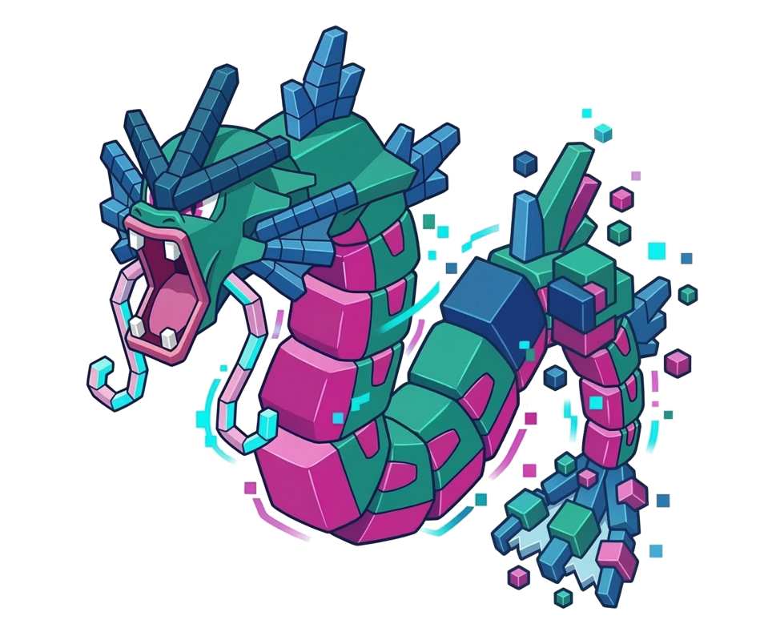
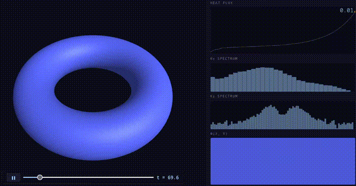

# `gyaradax`: Gyrokinetics in JAX

<p align="center">
  
</p>

`gyaradax` is a JAX code for local flux-tube gyrokinetic simulations. It is based on [GKW](https://bitbucket.org/gkw/gkw). It provides a differentiable solver for electrostatic and electromagnetic (A∥, B∥) turbulence with adiabatic or kinetic electrons and a linearized Fokker-Planck collision operator, with an optional CUDA backend and multi-GPU velocity-space sharding.

This was made possible with significant usage of agentic workflows. [PROMPT.md](docs/PROMPT.md) contains the prompt used to obtain the initial working version of `gyaradax`

Check out [our whitepaper](https://arxiv.org/abs/2604.06085), or see [agent notes](docs/NOTES.md) for a detailed walkthrough of GKW and this reimplementation (§13 there covers performance, memory and multi-GPU sharding).

<p align="center">
  
</p>


## Installation

Create a conda environment and install the CPU/base package:
```bash
conda env create -f environment.yml
conda activate gyaradax_env
pip install -e ".[dev]"
```

This installs `gyaradax` in editable mode with the base JAX dependency, numpy, and dev tools (pytest, ruff, black). The conda environment provides common build tools and, when CUDA work is needed, the CUDA toolkit (>= 13.1), cuDNN, cmake, and a C++ compiler.

### CUDA Backend
The optional CUDA backend provides fused kernels for the linear RHS (electrostatic and electromagnetic), the electromagnetic field moments and the nonlinear Poisson bracket (cuFFT, plus cuFFTDx row kernels from `nvidia-mathdx`). On an H100 it runs 1.6-1.7x faster than the previous CUDA backend for electrostatic cases, and 2.6-3.0x (electrostatic) to 2.9-4.2x (electromagnetic) faster than JAX on nonlinear runs at production grid sizes. It requires a GPU with compute capability >= 80. Install the CUDA JAX extra (which also brings `nvidia-mathdx` and NCCL) before building or using CUDA kernels:

```bash
pip install -e ".[cuda13,dev]"
```

This also installs the `gyaradax` command (re-run it after pulling if the command is missing).

From `gyaradax/backends/cuda_kernels/`:
```bash
mkdir -p _build && cd _build && cmake .. -DCMAKE_BUILD_TYPE=Release && cmake --build . -j$(nproc) && cmake --install . && cd ..
```

**GPU architectures.** By default (`GPU_ARCHITECTURES=native`) CMake compiles for the GPU of the
machine it runs on, so the same commands work on an H100 node (sm_90) and on a B300 node (sm_103) —
but that library then runs only on that GPU type. For a checkout shared by different node types, or
on a build node without a GPU, list the architectures explicitly:
```bash
cmake .. -DCMAKE_BUILD_TYPE=Release -DGPU_ARCHITECTURES="90;103"   # H100 + B300 in one library
```
The cuFFT LTO callbacks are built for compute 80/90/100 (`LTO_ARCHITECTURES`), which covers A100,
H100 and Blackwell, and the cuFFTDx bracket is instantiated for every kernel architecture. CMake
prints the target architectures, jaxlib and CUDA toolkit versions, and whether cuFFTDx was found;
`gyaradax info` shows what the installed library provides (CUDA kernels, v6 bracket, NCCL).

## Structure

- **`solver.py`**: RK4 integrator and the multi-step driver `gksolve`.
- **`backends/`**: Linear RHS (Terms I-XI) and nonlinear bracket, JAX and CUDA. See [CUDA build instructions](#cuda-backend).
- **`fields.py`, `integrals.py`**: Field solves (phi, A∥, B∥) and flux integrals.
- **`precompute.py`**: Static coefficients (stencils, species terms, EM factors).
- **`cfl.py`**: Adaptive timestep.
- **`collisions.py`**: Linearized Fokker-Planck collision operator.
- **`geometry/`**: Geometry models (circular, s-alpha, Miller, GKW geom.dat) and metric tensors.
- **`sharding.py`**: Multi-GPU velocity-space sharding.
- **`simulate.py`, `cli.py`**: Simulation runtime and the `gyaradax` command.
- **`eigenvalue.py`, `quasilinear/`**: Linear eigenvalue solver and quasilinear transport.
- **`params.py`, `state.py`**: Configuration and state pytrees.
- **`diag.py`, `plot_utils.py`**: Diagnostics and visualization.

## Running Simulations

### Basic usage

Installing the package provides a `gyaradax` command. Everything that defines a
run — adiabatic vs kinetic electrons, electromagnetic terms, velocity-space
sharding, backend — is read from the YAML config; flags only override it.

```bash
gyaradax run configs/iteration_13.yaml --device 0   # run a simulation
gyaradax bench configs/adiabatic_a.yaml --backend cuda   # measure throughput
gyaradax info                                        # devices and backends
```

Electromagnetic and multi-GPU runs need no extra flags — a config carrying
`solver.nlapar` or a `sharding:` block is picked up automatically:

```bash
gyaradax run configs/nl_em_apar.yaml            # electromagnetic, kinetic electrons
gyaradax run configs/my_big_case.yaml           # sharded if the config says so
gyaradax run configs/my_case.yaml --n-gpus 4    # shard over 4 GPUs, layout from the grid
```

When several YAML configs share the same grid and static parameters they are
batched automatically under one `jax.vmap`, each member writing its own run
directory as a single run would:

```bash
gyaradax run configs/adiabatic_a.yaml configs/adiabatic_b.yaml --device 0
```

Every run writes into its output directory: the effective `config.yaml` (the
input config with the command-line choices folded in), `geometry.pkl`, the
diagnostics (`fluxes.npz`, spectra, `dt_history.npz`), a restart snapshot
`step_*.npz` refreshed every `--snapshot-every` blocks (default 1), and `run_info.jsonl` (one line per
invocation). Point `gyaradax run` at that directory to resume or extend it:

```bash
gyaradax run outputs_kinetic_my_case                  # continue up to solver.n_steps
gyaradax run outputs_kinetic_my_case --n-steps 2000   # or run 2000 more steps
```

Debug output is off by default: `--telemetry` writes per-block timings, dt and
device memory to `telemetry.jsonl`, `--profile` traces one block into
`profile/` with a GPU kernel summary in `profile_summary.json`, and `--debug`
turns on both.

**See [docs/CLI.md](docs/CLI.md) for the full command reference**, including
the auto-detection table, multi-GPU guidance and every flag.

`python -m gyaradax ...` is the same command where the console script is not on
`PATH`, and `python scripts/run.py CONFIG ...` still works as a thin shim over
`gyaradax run`.

### Usage
#### Run a simulation
```python
from gyaradax.simulate import gk_from_config, gksimulate

# load yaml and run with IO/checkpointing
df, geometry, params, state, pre = gk_from_config("configs/my_sim.yaml")
df, phi, fluxes, state = gksimulate(
  df, geometry, params, state, 1200, pre=pre,
  output_dir="outputs", checkpoint_interval=120
)
```

#### Resume from GKW checkpoints
`gyaradax` can resume from GKW binary `K` files. The simplest way is `gk_from_gkw_dir`, which loads geometry, params, and the last K-file automatically:
```python
from gyaradax.simulate import gk_from_gkw_dir, gksimulate

# loads input.dat, geometry, and resumes from the last K-file
df, geometry, params, state, pre = gk_from_gkw_dir("/path/to/gkw/run/")
df, phi, fluxes, state = gksimulate(df, geometry, params, state, 120, pre=pre)
```

#### Configuration from GKW
If you have an existing GKW run, you can extract its parameters and geometry into yaml:
```bash
gyaradax convert /path/to/gkw_run configs/my_sim.yaml
```

### CUDA backend
Once compiled, the CUDA backend is auto-detected:
```python
# auto-detect (uses CUDA if available, falls back to JAX)
params = GKParams(backend="auto")

# force CUDA
params = GKParams(backend="cuda")
```

Or via config YAML:
```yaml
solver:
  backend: cuda
```

## Testing
```bash
python -m pytest tests/ -x -q
```

Most tests require GKW reference data. Set the `GKW_DATA_ROOT` environment variable to the directory containing the reference runs (e.g. `iteration_8/`, `iteration_13/`, `kinetic_electrons/`). These tests skip when the data is not available.

## State of the project

**Verification**:
- [x] Empirical validation against reference GKW trajectories.
- [x] Analytical validation on RH and Cyclone Base Case.
- [x] Differentiable programming: inverse problem and sensitivity analysis.
- [ ] GKW tests and benchmarks (see [the gkw paper](docs/gkw.pdf) and Chapter 11 in the manual).
- [ ] Solver-in-the-Loop and PINNs as an ML showcase.
- [ ] Portable unit tests

**Physics and solver extensions**:
- [x] Linear solver.
- [x] Adiabatic electrons corrections and cases (ion only, single species).
- [x] Kinetic electrons (multi-species).
- [x] Electromagnetic effects (A∥, B∥).
- [x] Collisionality (linearized Fokker-Planck).

**Optimization**:
- [x] JAX-based improvements.
- [x] CUDA backend (fused linear RHS, field moments and nonlinear bracket; electrostatic and electromagnetic).
- [x] Multi-GPU velocity-space sharding (species, vpar, mu).
- [ ] Fully spectral solver.
- [ ] Implicit/explicit integration (IMEX).


## Citing
```
@misc{galletti2026gyaradax,
      title={gyaradax: Local Gyrokinetics JAX Code}, 
      author={Gianluca Galletti and Eric Volkmann and Johannes Brandstetter},
      year={2026},
      primaryClass={physics.plasm-ph},
      url={https://arxiv.org/abs/2604.06085}, 
}
```
